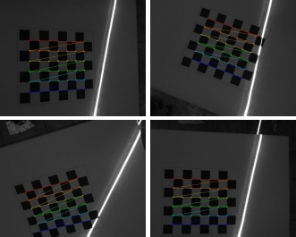

# Etna

Etna meta-package contains packages and libraries for supporting Laser Metal Deposition (LMD)
automation based on [ROS-Industrial](http://www.ros.org/wiki/Industrial).

Laser Metal Deposition (LMD) is a direct laser deposition technique focused on direct
manufacturing of metal parts. This is the direct manufacturing of metal parts through the
successive deposition of melted tracks layer by layer, building the component directly from
its CAD model.

Unlike Selective Laser Melting (SLM), mainly used for rapid prototyping, consisting on the
deposition of powder layers and their subsequent laser melt, it only adds the required material.
Moreover, this additive manufacturing (AM) technique works on current processing technology,
known as Laser Cladding, commonly used for repair of metal components. This makes LMD a
promising technique for retrofitting of current industrial facilities towards the digital
factory (Industrie 4.0).

## Contents

This meta-package currently contains packages that provide nodes and libraries for on-line
3D scanning and off-line 3D path programming for ABB industrial robots. It also includes
the required utility for the scanning calibration, which was presented in IEEE INDIN 2015.

[INDIN 2015 presentation](./etna_scanning/doc/RobEyeEtna.pdf)

It contains four packages:
- etna_workcell: contains the working cell description files.
- etna_scanning: contains the on-line scanning tool for LMD monitoring.
- etna_calib: contains the 3D calibration tools required for scanning.
- etna_planning: contains the off-line path planning tool for LMD automation.

[](./etna_scanning/media/robscan.mp4)

## 3D scanning

The solution is based on the 3D triangulation principle, which uses a laser stripe and a camera
to determine the 3D points where the laser intersects the piece. The arrangement of laser and
camera determines the resolution and accuracy of the system. This means, the system is able to be
adapted for different part sizes with a simple setup readjustment.

The 3D triangulation method uses point correspondences to map from 2D image points to 3D
coordinates. First, the projected laser stripe is detected using a center of gravity peak detector
to determine the points of maximum light intensity in the image. Second, each laser peak detected
is transformed to a 3D point in the camera coordinates. Third, the 3D points are translated from
camera coordinates to the robot coordinates. Thus, since the camera is attached to the robot, the
robot pose is used for reconstructing the 3D point cloud of the piece.

To launch the on-line 3D scanning system:

```
roslaunch etna_workcell etna_robscan.launch
```

## 3D calibration

A calibration procedure is required to perform the 3D point cloud reconstruction. The method uses
an inexpensive planar checkerboard pattern. It uses the same set of images (shown in the next
figure) to perform both camera and laser calibration. In this way, the system is calibrated in
the robot coordinates, ensuring a proper correspondence between camera and robot coordinates and
avoiding complex and accurate mechanical couplers.



*Automatic checkerboard detection in different robot positions for system calibration.*

The calibration procedure consists in placing fixed the checkerboard and moving the robot at
arbitrary orientations in front of the pattern. In each position, an image is acquired and its
corresponding robot pose is recorded. For each image, the checkerboard pose is estimated and the
laser intersection is determined. Thus, the estimated point cloud is used to find the best-fit
laser plane. Different least-squares algorithms have been used to minimize errors in the
calibration estimation problem.
