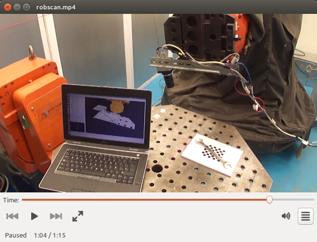

# Etna

Etna meta-package contains packages and libraries for supporting Laser Metal Deposition (LMD)
automation based on [ROS-Industrial](http://www.ros.org/wiki/Industrial).

Laser Metal Deposition (LMD) is a direct laser deposition technique focused on direct
manufacturing of metal parts. This is the direct manufacturing of metal parts through the
successive deposition of melted tracks layer by layer, building the component directly from
its CAD model.

Unlike Selective Laser Melting (SLM), mainly used for rapid prototyping, consisting on the
deposition of powder layers and their subsequent laser melt, it only adds the required material.
Moreover, this additive manufacturing (AM) technique works on current processing technology,
known as Laser Cladding, commonly used for repair of metal components. This makes LMD a
promising technique for retrofitting of current industrial facilities towards the digital 
factory (Industrie 4.0).

## Contents

This meta-package currently contains packages that provide nodes and libraries for on-line
3D scanning and off-line 3D path programming for ABB industrial robots. It also includes
the required utility for the scanning calibration, which was presented in IEEE INDIN 2015.

[INDIN 2015 presentation](./etna_scanning/doc/RobEyeEtna.pdf)

It contains four packages:
- etna_workcell: contains the working cell description files.
- etna_scanning: contains the on-line scanning tool for LMD monitoring.
- etna_calib: contains the 3D calibration tools required for scanning.
- etna_planning: contains the off-line path planning tool for LMD automation.

[](./etna_scanning/media/robscan.mp4)

## 3D scanning

To launch the on-line 3D scanning system:

```
roslaunch etna_workcell etna_robscan.launch
```
